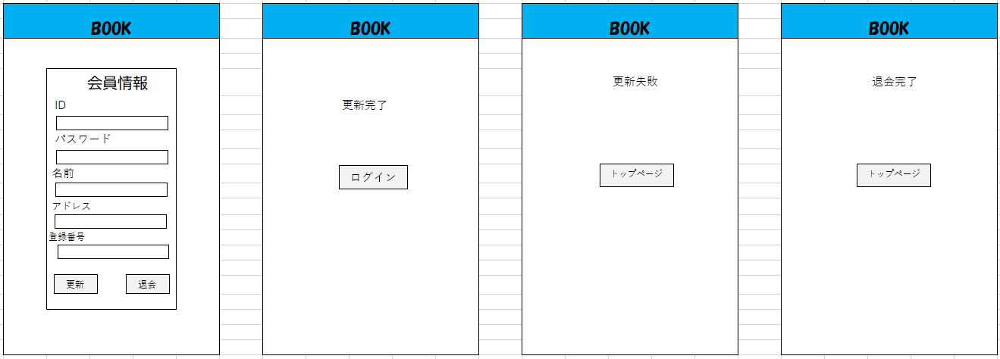

### 画像詳細図
## 会員情報更新画面
*****

*****
補足：対応DBの列はDB設計後、〇を対応する・カラム名に差し替えること。

| ID | 要素 | 内容 | アクション | イベント | 対応DB　|
|----|------|-----|-----------|----------|--------|
|1   |ヘッダー |サイト名表示|-    |-         |-       |
|3   |id    |入力欄 |テキスト入力|-        |〇      |
|4   |pass  |入力欄|テキスト入力|-         |〇      |
|5   |name  |入力欄|テキスト入力|-         |〇      |
|6   |address|入力欄|テキスト入力|-         |〇      |
|7   |credit number |入力欄|テキスト入力|-         |〇      |
|8   |更新ボタン|ボタン|クリック|ログイン処理実行|-|
|9   |退会ボタン|ボタン|クリック|ログイン処理実行|-|

| ID | 要素 | 内容 | アクション | イベント | 対応DB　|
|----|------|-----|-----------|----------|--------|
|1   |ヘッダー |サイト名表示|-    |-         |-       |
|2   |loginボタン|ボタン|クリック|ログイン画面に遷移|-|

| ID | 要素 | 内容 | アクション | イベント | 対応DB　|
|----|------|-----|-----------|----------|--------|
|1   |ヘッダー |サイト名表示|-    |-         |-       |
|2   |topボタン|ボタン|クリック|トップページに遷移|-|

| ID | 要素 | 内容 | アクション | イベント | 対応DB　|
|----|------|-----|-----------|----------|--------|
|1   |ヘッダー |サイト名表示|-    |-         |-       |
|2   |cartボタン|ボタン|クリック|カート画面に遷移|-|
