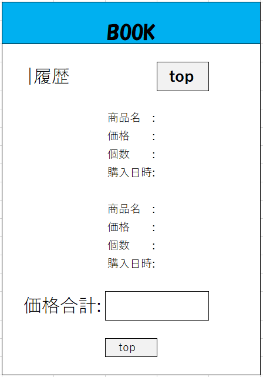

### 画像詳細図
## 会員情報更新画面
*****

*****
補足：対応DBの列はDB設計後、〇を対応する・カラム名に差し替えること。

| ID | 要素 | 内容 | アクション | イベント | 対応DB　|
|----|------|-----|-----------|----------|--------|
|1   |バナー |サイト名表示|-    |-         |-       |
|2   |ログイン|テキスト表示|-   |-         |-       |
|3   |ID    |入力欄 |テキスト入力|-        |〇      |
|4   |PASS  |入力欄|テキスト入力|-         |〇      |
|5   |ログインボタン|ボタン|クリック|ログイン処理実行|-|
|6   |商品検索|テキスト画像|-    |-        |-       |
|7   |商品名 |テキスト表示|-    |-        |-        |
|8   |商品名 |入力欄|テキスト入力|-        |〇|
|9   |カテゴリ|テキスト表示|-|-|-|
|10  |タグ |テキスト表示|-|-|-|
|11  |タグ |チェックボックス|選択|-|〇|
|12  |検索   |ボタン|クリック|検索処理実行|〇|
|13  |商品一覧|画像ボタン|クリック|商品一覧へ遷移|〇|
|14  |カートの中|画像ボタン|クリック|カートの中へ遷移|〇|
|15  |登録情報|画像ボタン|クリック|登録情報へ遷移|〇|
|16  |商品一覧|テキスト表示|-|-|〇|
|17  |商品画像|画像リンク|クリック|商品詳細へ遷移|〇|
|18  |商品名 |テキストリンク|クリック|商品詳細へ遷移|〇|
|19  |価格   |テキスト表示|-|-|〇|

