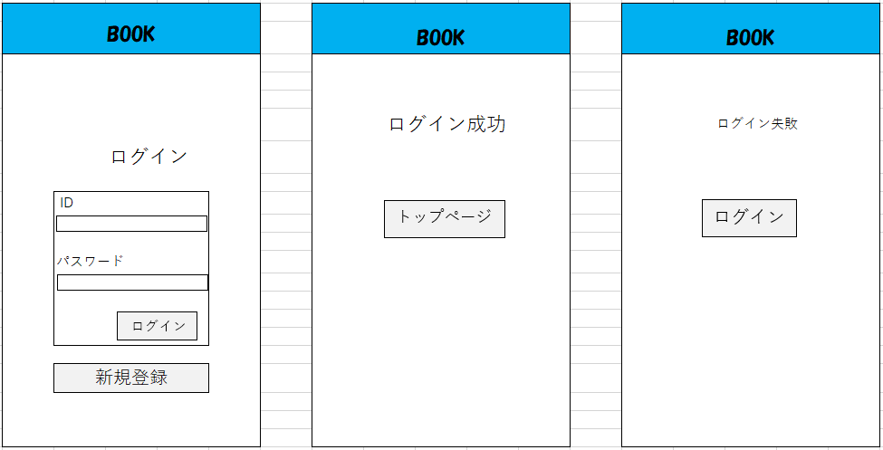

## ログイン画面
*****

*****
## ログインページ
| ID | 項目名 | 内容 | アクション | イベント | 対応DB |
|----|------|-----|-----------|----------|--------|
|1   |ヘッダー|サイト名表示|-|-|-|
|2   |ログイン|テキスト画像|-|-|-|
|3   |ID(メールアドレス)|入力欄|テキスト入力　varchar(50)　メールアドレス|-|〇|
|4   |パスワード|入力欄|テキスト入力　半角英数字8文字以上16文字以下|-|〇|
|5   |ログイン|ボタン|クリック|ログイン処理実行||
|6   |新規登録|ボタン|クリック|新規登録ページへ移る||
|7   |エラーメッセージ|テキスト表示|ID（メールアドレス）、パスワードが間違っている、 パスワードの文字数が足りない時赤文字でエラーメッセージ表示|-|〇|

