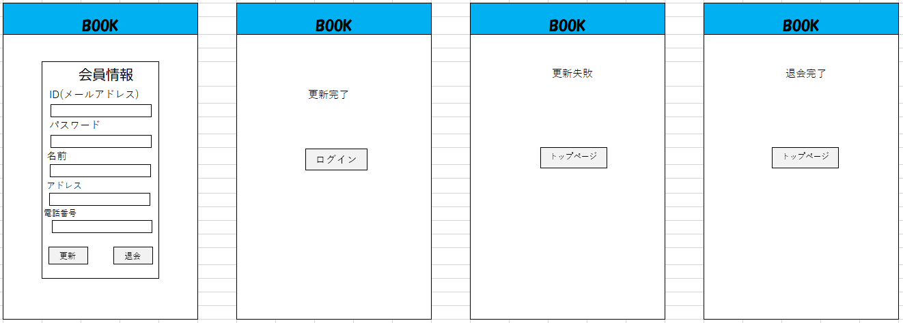

## 会員情報更新画面
*****

*****
補足：対応DBの列はDB設計後、〇を対応する・カラム名に差し替えること。

| ID | 要素 | 内容 | アクション | イベント | 対応DB　|
|----|------|-----|-----------|----------|--------|
|1   |ヘッダー |サイト名表示|-    |-         |-       |
|3   |ID    |入力欄 |テキスト入力|-        |〇      |
|4   |パスワード  |入力欄|テキスト入力|-         |〇      |
|5   |名前  |入力欄|テキスト入力|-         |〇      |
|6   |アドレス|入力欄|テキスト入力|-         |〇      |
|7   |登録番号 |入力欄|テキスト入力|-         |〇      |
|8   |更新|ボタン|クリック|ログイン処理実行|-|
|9   |退会|ボタン|クリック|ログイン処理実行|-|

## 更新完了
| ID | 要素 | 内容 | アクション | イベント | 対応DB　|
|----|------|-----|-----------|----------|--------|
|1   |ヘッダー |サイト名表示|-    |-         |-       |
|2   |ログイン|ボタン|クリック|ログイン画面に遷移|-|

## 更新失敗
| ID | 要素 | 内容 | アクション | イベント | 対応DB　|
|----|------|-----|-----------|----------|--------|
|1   |ヘッダー |サイト名表示|-    |-         |-       |
|2   |トップページ|ボタン|クリック|トップページに遷移|-|

## 退会完了
| ID | 要素 | 内容 | アクション | イベント | 対応DB　|
|----|------|-----|-----------|----------|--------|
|1   |ヘッダー |サイト名表示|-    |-         |-       |
|2   |トップページ|ボタン|クリック|トップページに遷移|-|
