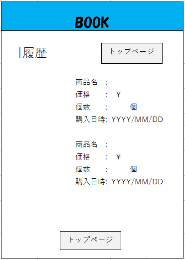

## 履歴
*****

*****
補足：対応DBの列はDB設計後、〇を対応する・カラム名に差し替えること。

| ID | 項目名 | 内容 | アクション | イベント | 対応DB　|
|----|------|-----|-----------|----------|--------|
|1   |ヘッダー |サイト名表示|-    |-         |-       |
|2   |商品名 |テキスト表示|-    |-        |-        |
|3   |価格 |テキスト表示|-    |-        |-        |
|4   |個数 |テキスト表示|-    |-        |-        |
|5   |購入日時 |テキスト表示|-    |-        |-        |
|6   |トップページ|ボタン|クリック|トップページへ遷移|-        |
